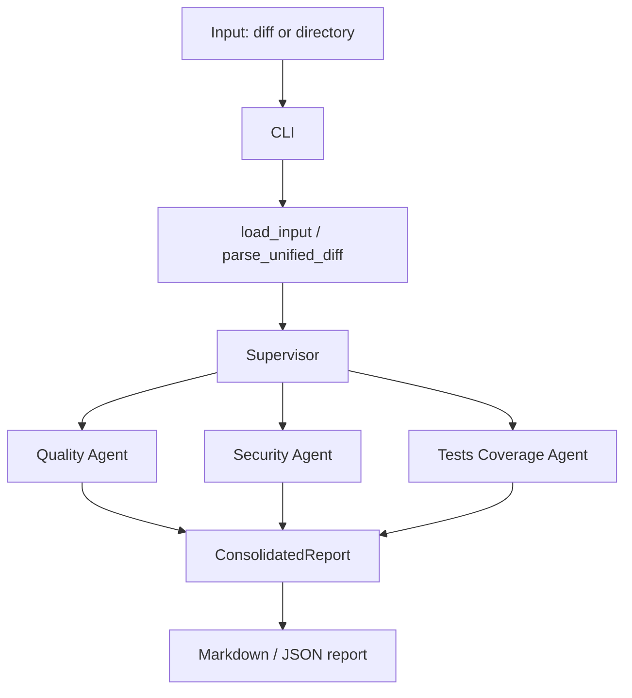

# MultiAgent: Multi-Agent Orchestration

This lab builds a system where specialized agents collaborate under a supervisor to review code changes and produce a consolidated report.

## Lab idea

The reference problem is pull request review. A single generic prompt often mixes different dimensions or stays too shallow. This lab separates responsibilities:

- `Code Quality Agent`: analyzes naming, complexity, duplication, and readability.
- `Security Agent`: analyzes exposed secrets, unsafe patterns, suspicious dependencies, and injection signals.
- `Tests Coverage Agent`: analyzes missing tests and weak coverage for code changes.
- `Supervisor`: decides which agents to invoke, consolidates findings, avoids redundancy, and synthesizes a final report.

## MVP goal

Analyze a diff or a code directory and generate a Markdown report with findings grouped by dimension.

## What this base includes

- Python CLI
- Unified diff parser
- Three specialized agents
- Supervisor with heuristic routing
- Markdown output
- Demo inputs for local testing

## Structure

```text
multiagent/
  README.md
  pyproject.toml
  examples/
    quality.diff
    security.diff
    bad_pr.diff
    bad_pr.py
  consumer-multiagent/
    README.md
    app.py
    .github/
      workflows/
        pr-review.yml
  scripts/
    benchmark_parallel.ps1
  src/
    multiagent_lab/
      cli.py
      models.py
      diff_parser.py
      comparison.py
      report.py
      supervisor.py
      prompts.py
      llm.py
      agents/
        base.py
        quality.py
        security.py
        tests_coverage.py
```

## Simple diagram



## How to run it locally

1. Create a virtual environment if you want to isolate dependencies.
2. Install the project in editable mode.
3. Run the CLI over one of the example diffs.

```bash
python -m pip install -e .
multiagent-lab --input examples/quality.diff --output report.md
```

You can also pass a source directory instead of a diff.

## LLM mode with function calling

If you configure an OpenAI-compatible provider, the system can use function calling to decide routing and structure findings.

Environment variables:

- `OPENAI_API_KEY`: provider key
- `OPENAI_BASE_URL`: OpenAI-compatible base URL, default `https://api.openai.com/v1`
- `MULTIAGENT_MODEL`: model to use, default `gpt-4.1-mini`

Example:

```bash
$env:OPENAI_API_KEY="your_key"
multiagent-lab --input examples/security.diff --mode llm
```

In `auto`, the system uses LLM mode when credentials are present and falls back to heuristics otherwise.

## GitHub Actions

To run it automatically on each PR:

1. Create the workflow in `.github/workflows/pr-review.yml`.
2. Store `OPENAI_API_KEY` in GitHub Secrets.
3. Optionally store `OPENAI_BASE_URL` and `MULTIAGENT_MODEL`.
4. Open or update a PR.

The workflow generates `pr.diff`, decides the analysis mode based on whether the PR comes from a fork, publishes the report in the job summary, uploads it as an artifact, and comments on the PR with the full report. If no secret is available, the system falls back to heuristic mode.
The coordination comparison report is optional and only runs when the PR has the `run-comparison` label. It compares the 2-agent baseline versus the 3-agent supervisor for the same diff.
The parallel execution mode is also optional and can be enabled with the `parallel-agents` label or with the `--parallel-agents` CLI flag.

### Reusable workflow

The analysis engine now lives in `.github/workflows/pr-review-core.yml` and is called from the local PR workflow. Other repositories can reuse the same logic by creating a small caller workflow like this:

```yaml
name: PR Review Agents

on:
  pull_request:
    types: [ready_for_review, synchronize, reopened, labeled]

permissions:
  contents: read
  pull-requests: write
  issues: write

jobs:
  policy:
    runs-on: ubuntu-latest
    outputs:
      mode: ${{ steps.policy.outputs.mode }}
      compare: ${{ steps.policy.outputs.compare }}
      parallel: ${{ steps.policy.outputs.parallel }}
      base_sha: ${{ steps.policy.outputs.base_sha }}
      head_sha: ${{ steps.policy.outputs.head_sha }}
      pull_number: ${{ steps.policy.outputs.pull_number }}
    steps:
      - uses: actions/github-script@v7
        id: policy
        with:
          script: |
            const isFork = context.payload.pull_request.head.repo.full_name !== context.repo.owner + '/' + context.repo.repo;
            const mode = isFork ? 'heuristic' : 'auto';
            const { owner, repo } = context.repo;
            const pull_number = context.payload.pull_request.number;
            const labels = await github.paginate(github.rest.issues.listLabelsOnIssue, {
              owner,
              repo,
              issue_number: pull_number,
              per_page: 100,
            });
            const hasComparisonLabel = labels.some((label) => label.name === 'run-comparison');
            const hasParallelLabel = labels.some((label) => label.name === 'parallel-agents');
            core.setOutput('mode', mode);
            core.setOutput('compare', String(hasComparisonLabel));
            core.setOutput('parallel', String(hasParallelLabel));
            core.setOutput('base_sha', context.payload.pull_request.base.sha);
            core.setOutput('head_sha', context.payload.pull_request.head.sha);
            core.setOutput('pull_number', String(pull_number));

  review:
    needs: policy
    uses: your-org/your-repo/.github/workflows/pr-review-core.yml@main
    with:
      base_sha: ${{ needs.policy.outputs.base_sha }}
      head_sha: ${{ needs.policy.outputs.head_sha }}
      pull_number: ${{ needs.policy.outputs.pull_number }}
      review_mode: ${{ needs.policy.outputs.mode }}
      run_comparison: ${{ needs.policy.outputs.compare == 'true' }}
      parallel_agents: ${{ needs.policy.outputs.parallel == 'true' }}
    secrets:
      OPENAI_API_KEY: ${{ secrets.OPENAI_API_KEY }}
      OPENAI_BASE_URL: ${{ secrets.OPENAI_BASE_URL }}
      MULTIAGENT_MODEL: ${{ secrets.MULTIAGENT_MODEL }}
```

If the reusable workflow lives in a private repository, the calling repository must have access to it. For a shared internal setup, the reusable workflow is usually the cleanest option because the analysis logic stays in one place while each repo only keeps the small caller workflow.

A minimal caller example is shown in the reusable workflow snippet above. Copy that pattern into any repository that should reuse the shared analysis engine.

Fork policy:

- If the PR comes from a fork, the workflow uses `heuristic` mode even if secrets exist.
- If the PR comes from the same repository, it uses `auto` mode and uses LLM when the secret exists.

Automatic labeling:

- If the quality agent finds findings, the workflow adds or updates `quality-review-needed`.
- If the security agent finds findings, the workflow adds or updates `security-review-needed`.
- If the tests coverage agent finds findings, the workflow adds or updates `tests-coverage-review-needed`.
- If a dimension has no findings, that label is not added.
- If you add the `run-comparison` label, the workflow also publishes a comparison report with coordination metrics and a conclusion about scaling.
- Add the `run-comparison` label to a PR when you want the optional 2-agent versus 3-agent comparison to run.

To set the label in GitHub:

1. Open the pull request.
2. Use the `Labels` sidebar to add `run-comparison`, or create it first under repository labels if it does not exist yet.
3. Add `parallel-agents` if you want the selected agents to run concurrently.
4. The workflow will rerun on the label event and generate the comparative report.

Merge blocking:

- When findings exist, the workflow creates an inline review on the changed lines.
- It marks the review as `REQUEST_CHANGES`.
- It fails the job at the end, so the branch cannot be merged when this workflow is required as a status check.

## Coordinating report

The report now includes a coordination metrics section. This is the easiest way to verify how the supervisor scales as you add agents:

- total agents
- invoked agents
- analyses produced
- total findings
- duplicate findings
- coverage score
- runtime in milliseconds
- prompt tokens, completion tokens, and total tokens

To compare scaling, run the same PR with two agents and then with three agents, and compare the coordination metrics section. A good supervisor should keep:

- low redundancy
- high routing precision
- reasonable runtime growth
- better coverage as agents are added
- token growth that matches the extra work the added agent performs

## Sequential vs parallel benchmark

Use the bundled PowerShell script to compare orchestration latency with and without parallel execution on the same input.

```powershell
powershell -ExecutionPolicy Bypass -File scripts/benchmark_parallel.ps1 -Input examples/bad_pr.diff -Runs 5
```

Recommended settings:

- Use `-Mode heuristic` when you want to measure orchestration overhead more consistently.
- Use `-Mode auto` or `-Mode llm` when you want to include provider latency in the comparison.

The benchmark prints:

- average runtime for sequential and parallel execution
- median, min, and max runtime
- per-run deltas
- a simple speedup ratio and percentage

The normal PR review report also shows:

- routing token usage for the supervisor
- token usage per specialist agent
- total token usage for the whole PR analysis

That gives you one place to compare both token usage and latency between executions.

That makes it easy to show whether the supervisor scales well when more than one specialist agent is active.

## Automatic comparison report

You can also generate a side-by-side comparison between the 2-agent baseline and the full 3-agent supervisor.

This report is useful when you want to answer a concrete question:

- does the third agent add unique findings?
- does the supervisor keep redundancy under control?
- does runtime increase in a reasonable way?

Example:

```bash
multiagent-lab --input examples/bad_pr.diff --compare-agents --output comparison.md --json-output comparison.json
```

The comparison report includes:

- a table with coordination metrics
- a table with findings per dimension
- total token usage, prompt tokens, and completion tokens
- a textual conclusion about whether coordination scales well

## Expected demo flow

The system:

1. Reads the diff.
2. Detects code quality, security, and test coverage signals.
3. Invokes only the relevant agents.
4. Consolidates findings.
5. Writes a Markdown report with per-dimension sections.
6. Emits coordination metrics so you can measure routing and scale.
7. Optionally generates a comparative report between the 2-agent and 3-agent configurations.
8. Runs the selected specialist agents in parallel when more than one agent is invoked.

## Design decisions

### 1. Real specialization

Each agent works on one dimension and returns structured findings. That reduces noise and makes it easier to compare agents.

### 2. Supervisor as router and synthesizer

The supervisor does not just aggregate results. It also decides whom to call based on the diff and removes basic duplication before generating the report.

### 3. Structured communication

The exchange between components uses typed data models instead of free text. That makes it easier to extend the system to more agents.

### 4. Heuristic fallback by default

The first version works without an external API. Later, the same contract can connect to a model with function calling.

## Validation examples

Use these checks for the demo or to iterate on the design:

- Test a diff with naming or complexity issues.
- Test a diff with an exposed secret or an injection pattern.
- Verify that the supervisor skips irrelevant agents when the diff does not contain signals for them.
- Verify that the final report does not invent findings that no agent produced.
- Test what happens when an agent finds nothing.

## AI reflection

### Tools used

| Tool | What we used it for | Result (1-5) |
|---|---|---|
| Codex | Implementing agents, supervisor, parser, and CLI | 5 |
| Local AI or API with function calling | Future semantic analysis support | 4 |
| Markdown + example diffs | Documenting and demonstrating the flow | 5 |

### Biggest AI impact in this lab

AI adds the most value when it generates structured findings inside a narrow domain. In this lab, that is more visible in the specialized agents than in a generic prompt.

### Moment where AI did not help or introduced problems

If the agent prompt is too broad, it tends to invade other domains or repeat generic observations. The supervisor can also fail if it synthesizes too freely and invents issues.

### Change in the development cycle

With AI available, it is worth designing clear input and output contracts first. Then implement small agents and validate them with concrete examples before scaling coordination.

### Recommendation for the next team

Start with one agent and make it produce useful, consistent feedback. Then add the second agent and only after that add the supervisor. The hardest component is usually coordination, not individual analysis.

## Next extensions

- Add a third specialized agent for test coverage.
- Connect a real LLM provider.
- Run agents in parallel.
- Connect to GitHub to analyze real PRs.
